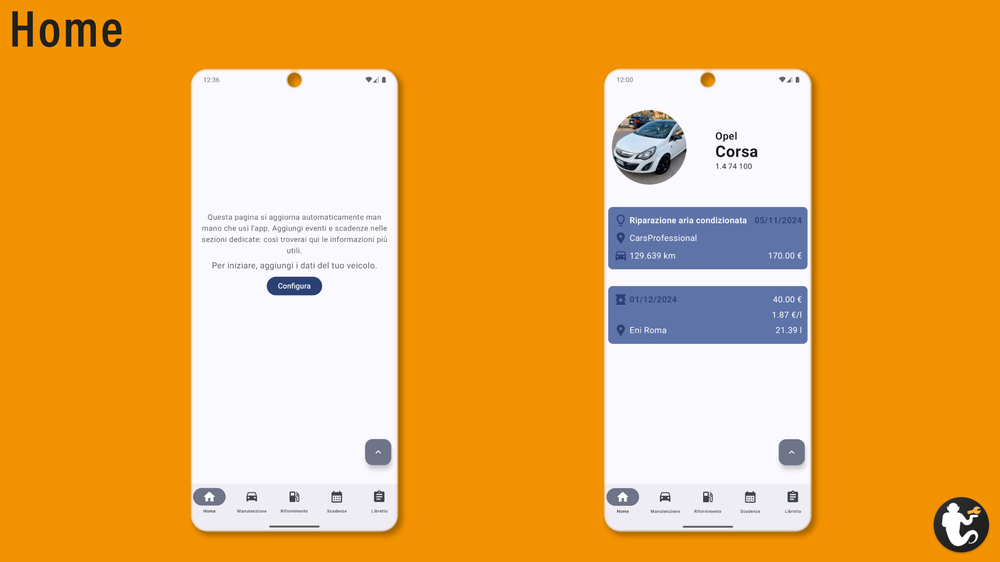
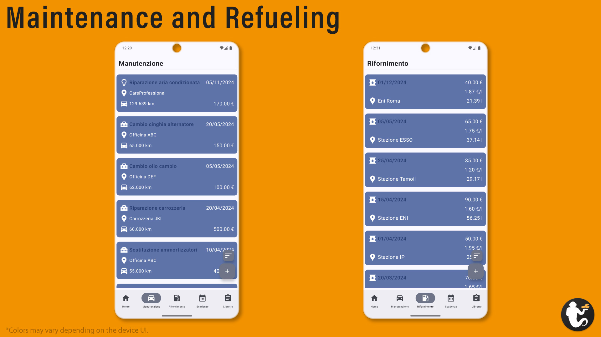
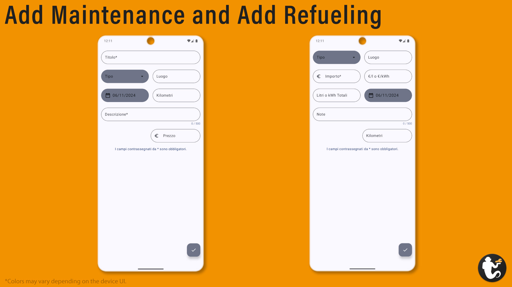
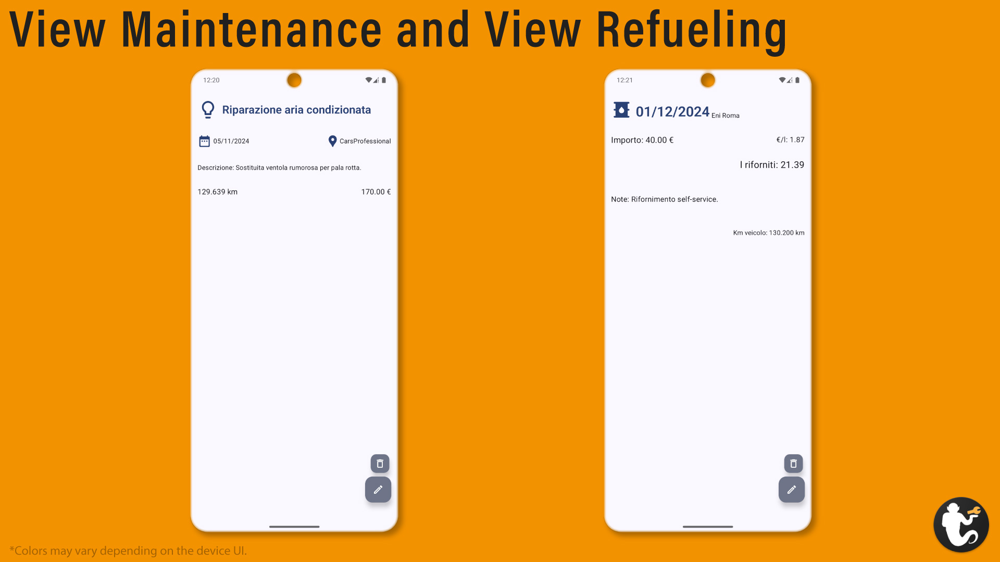
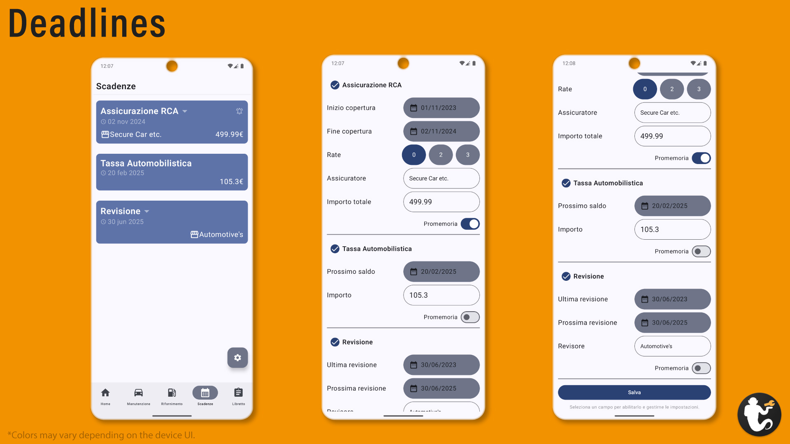
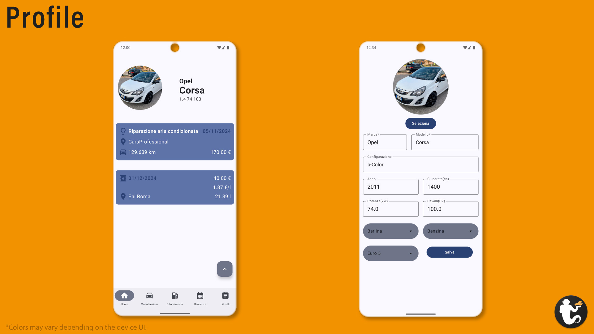
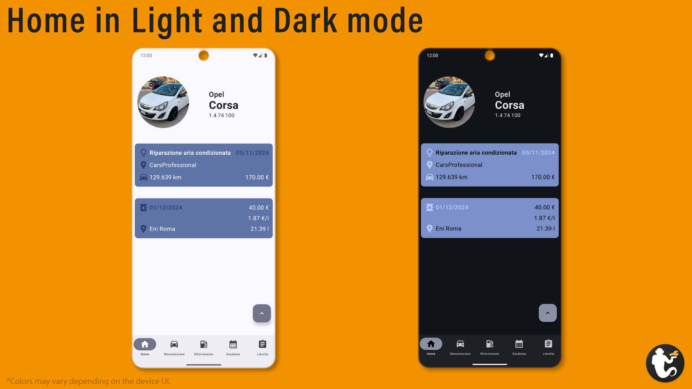
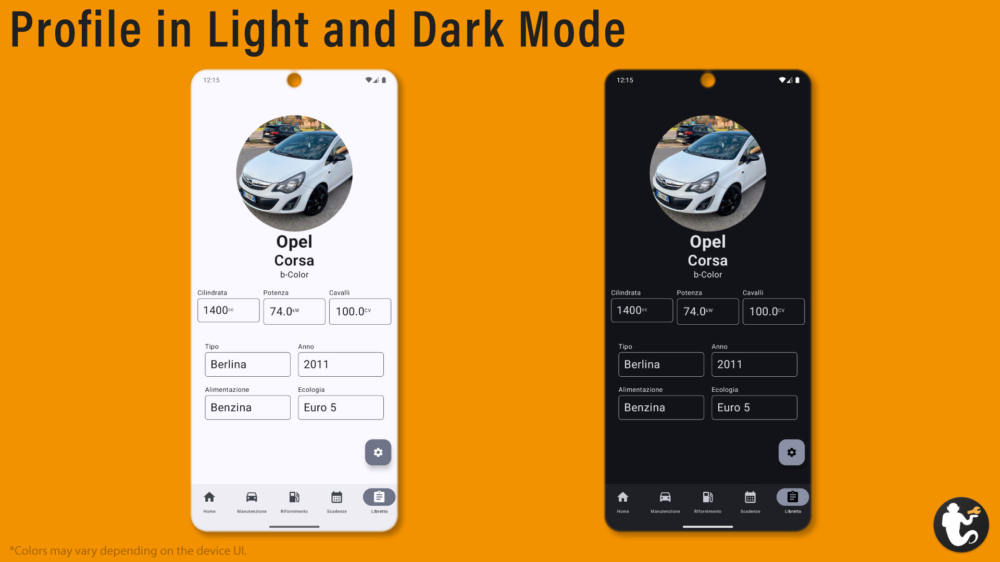

# MyCarGenie

MyCarGenie is an Android app coded in Kotlin and designed with Jetpack Compose. The aim of this app is to provide the generic automotive user or enthusiast a portal to track and manage their car through maintenance, refueling and expiration dates.
My car is always broken; she's 13 years old, so, as an usual old lady would, she's always at the mechanics doctor.
Every time there is the same question: "When did we change ${partName}?"
I'm always speechless. I can't remember this kind of things while reflecting about malloc implications on salmon fishing and how Socrates would have interpreted C language.
I was always thinking about drawing a schema or a sort of agenda, but notebooks or digital files are so easy to lose or forget.
So I decided to design and code an app to fill a void in private car management: an app as a tool, always in my pocket, ready to be updated or checked.
I brainstormed like a typical movie crazy guy, and the possibilities of creation were enormous.
The only thing I couldn't accept was designing my tool to be used via web or PC. Nobody waits to go home, turn on their computer, or put his private data on the web.
The app needed to be usable by me, my dad, and anyone with a phone, so MyCarGenie had to be light, simple, and compatible with most Android phones.
Therefore, I decided to design it to be compatible with Android 9 or newer, up to Android 15, which is now rolling out on the latest phones. The app uses only Material Design to stay light, integrates Room to manage SQL databases, and leverages native system functions to be as efficient as possible and occupy minimal storage.
After some more refinements mostly on graphics, my goal is to share this app through Google PlayStore on Android, now only for Italy, but in the future expanding to more countries with specific adaptations for local systems, values, and laws.
Update after update, I hope to be able to improve this tool.

In the project, in addiction to the Kotlin language, I decided to use:
- Room: To manage SQL databases,
- DataStore: To manage settings,
- AlarmManager: To manage exact reminders and notifications.
---

The development of the app had lots of tests on different devices of different categories. Daily tests were conducted on:
| Device          | Android       |
| -------------   |:-------------:|
| realme 3c       | 10            |
| Nothing 2a      | 14      |
| Pixel 8Pro(Emulated) | 15      |

The final project has been tested on the above devices and on different devices updated to various Android releases with success and no graphic bugs. 

---
## Navigation
The choice to have a navigation bar on the bottom of the app was made to help the user to move through pages in a fast and intuitive way.
The main structure is composed by 5 pages:
1. Home,
2. Maintenance,
3. Refueling,
4. Deadlines,
5. Profile.

---

  ### Home
  The Home page is the main screen, where the user lands upon opening the app.
  This screen includes design elements to provide the user with quick, summarized information about the vehicle.
  From top to the bottom the first section provides basic information about the car, such as brand, model and certain numeric characteristics.
  If the car's profile includes a photo, it is displayed in this section and shown as a thumbnail on the Home screen.
  Below this section the app provides one or two cards with information about today's or recent maintenance and refueling events.
  Each card is designed to match the layout used in Maintenance and Refueling pages.

  

  #### **Files involved:**
  - HomeScreen.kt : 
  When the page opens, information about the profile is loaded from carProfile, while the latest maintenance and refueling data are loaded with the help of homeViewModel.
  Some fonts dynamically adjust their size based on the lenght of the variable text to prevent truncation on longer words or on screens with lower pixel density.
  Font sizes were selected through direct testing on various devices to find the most suitable values for a typical smartphone display.
  The UI shows or hides different elements based on certain checks during loading, so it updates automatically whenever the user edits their profile or adds an event.
  
  - HomeViewModel.kt :
  This support file for the HomeScreen page stores data about the last maintenance and refueling events in the app cache.
  It includes a direct call to ManDao and RifDao to load getLastManBeforeToday and getLastRifBeforeToday(more about ManDao.kt and RifDao.kt later).
  Here, I also coded an auxiliary function that formats current date into the dd/MM/yyyy format.

---

  ### Maintenance and Refueling

> [!NOTE]
> The following text provides explanations for both Maintenance and Refueling features, as they were designed symmetrically, based on the same concept and code structure. 
> By using the word **"diary"** I'm referring to both databases; each followed by details of its specific features.
  
The Maintenance and Refueling pages are coded to display all entries from maintenance and refueling events from the man.db or rif.dp databases(see MainActivity.kt). From top to bottom, each page includes a TopBar, event cards, and a "plus" floating icon to add a new entry.

#### **Files involved :**
- ManScreen.kt and RifScreen.kt :  
These files contain the main ManutenzioneScreen and RifornimentoScreen composables, which display the content of the man.db and rif.db diary databases.
At the top of each page, there is a TopAppBar showing the page name and a sort icon. By clicking the sort icon, all entries from the diary database are reloaded by the date they were added, sorted by element ID from the highest to the lowest. By clicking the icon again, the entries are reloaded by effective date, the date the user specifies when adding an event. This is also the default way database content is loaded when the screen is displayed.
  In the main section of each page diary cards are dynamically generated and displayed by analyzing the database.
  To optimize performance on low-end devices I configured the page to load only 10 elements initially. Then, when the app detects that the user is at the end of the loaded list, one more element is loaded and so on.
  I tested performance on a Nothing 2a (a low-to-mid-range device), which managed more than 150 full loaded database entries smoothly. Obliviously, the first content loading process was lighter because of the one element at a time loading optimization.
  If respectively man.db or rif.db are empty a call-to-action message is showed inviting the user to add a first event.
  Each event card is designed to display the most important information for a given entry.

|  |  |
|---|---|
| **Maintenance** | On the left side of the card, there are the Title, Place and Kilometers elements, while on the right are the Date and Price. Next to the Title, an icon appears that varies based on the type of professional intervention selected. |
| **Refueling** | On the left side of the card there are the Date and Place, while on the right are the Total Price, Price-per-Unit, and Fuel Quantity. Next to Date, an icon appears that changes according to the type of fuel selected. |

At the bottom right of the diary screen,a floating "plus" icon button opens either the AddManScreen() or AddRifScreen() page, depending on the current page.

- AddManScreen.kt and AddRifScreen.kt :  
These files contain composables to add entries to the man.db or rif.db databases. At the top of each page, a TopAppBar is displays a back icon, which, when clicked, executes a back-button command.
In these pages, users can find all the fields to input details for diary event.
Each field has some restrictions on character type and number to prevent database overload or data type errors.

| **AddManScreen()** |
|---|
| The first field is the Title, marked with an asterisk to indicate that it is required, as noted at the bottom of the page: "Fields marked with * are required." These required fields help ensure the app displays an appropriate preview card in ManScreen and prevents accidental or incomplete database entries. The second field is Type. This is not a real field; instead, it is a clickable Box designed in the TypeDropdownMenu composable function. Here, the user can select an element from a list of pre-set type of intervention: Mechanic, Auto Electrician, Body Shop or Other. To the right of this field is the Location field, where the user can enter the shop name or geographic location of the event. In the following line, the user can select the vent date by clicking on the field itself to show the DatePicker. The default date shown is the current device date, so if the user does not choose a different date, this default will be saved as the event date. To the right of this line there is the Kilometers field. Recording kilometers is useful for tracking the timing and distance between related maintenance events, which mechanics often require. The next line includes another required field, the Description field, where the user can write whatever he wants, but limited to 500 characters. This choice has been made to avoid database overload and the subsequent breaking of the app. The final field is the Price field, which displays a "€" symbol by default, tailored for this first release in Italy. |

| **AddRifScreen()** |
|---|
| The first field is the Type, a clickable Box where the user can select a fuel type from a pre-set list: Gasoline, Diesel, LPG, CNG, Electric or Other. To the right of this field is the Location field, where the user can enter the station name or simply the geographic location of the event.  In the next line, on the left, the user can input the Total Price, a required field, while on the right of the same line is the Unit Price field. The next line shows the Total Fuel Units, automatically calculated once the user completes the previous two fields.  The placeholders in the Unit Price and Total Fuel Units fields vary based on the type of fuel selected in the Type dropdown menu. On the same line as Total Units, the user can select a Date for the entry by clicking on the field to display the DatePicker; if the user does not select a date, the current date will be saved as the event's. The following line includes is the Notes field, where the user can enter up to 500 characters of text. The final field is the Kilometers field. |

In both pages, once the user completes the last field, they can save the event by clicking "done" on the device's virtual keyboard, which will save the entry in the specific diary database. 
The main method to save an event is by pressing the floating "V" icon button.
If the user attempts to save an event with any required fields left incomplete, an error message will appear.

- ViewManutenzione.kt and ViewRifornimento.kt :
This page display the details of a diary event.
At the top of the app, there's a TopAppBar with a back icon on the left, and an edit icon and delete icon on the right. By clicking the back icon, a command to return to the previous screen is executed.
When the user clicks the edit button, the EditManutenzione or EditRifornimento screen opens. If the delete button is clicked, a confirmation dialog appears to prevent accidental deletion.
The main content of ViewManScreen() and ViewRifScreen() composables is loaded based on the ID the system collects when the user clicks on a specific card, ensuring that the correct event details are displayed.
For Maintenance, the view shows the Title with a specific Type icon on the left, followed by Date and Place, then Description, and, on the last line, Kilometers and Price.
For Refueling, the view displays the Date with a specific Type icon on the left and the Place on the right. The next line shows Total Price and Unit Price, followed by Total Fuel Units, then Notes. On the last line, the user can see the Kilometers.

- EditManutenzione.kt and EditRifornimento.kt :
These composables allow the user to edit entries in the man.db or rif.db database. At the top of the app, there's a TopAppBar with a back icon, which, when clicked, executes a back command.
Here, the user can edit all fields related to a specific diary event, with the entry ID retrieved by the system when the user selects a specific card, similarly to ViewManScreen() and ViewRifScreen().

The field configuration and save functionality are the same as in the AddManScreen() or AddRifScreen() composables, but this time the fields are pre-filled with the existing values when the page loads.

- ManViewModel.kt and RifViewModel.kt :
These files serve as the main controllers for managing Maintenance and Refueling entries. They handle all operations to display, sort, save, edit and delete entries in the respective diary database.
Key functions are DeleteMan and DeleteRif, which delete an entry by calling the delete command from ManDao or RifDao; SaveMan and SaveRif to save a new entry to the database; UpdateMan and UpdateRif to edit an entry; and SortMan and SortRif to sort elements displayed in ManScreen() or RifScreen().

- ManDao.kt and RifDao :
These files contain the main SQL commands for diary ViewModels. SQL queries are managed by Room.

- ManState.kt and RifState.kt :
These files define the state management for the diary entries. MutableState values are essential here to ensure correct operations on the man.db and rif.db databases.

- ManEvent.kt and RifEvent.kt :
These files define interfaces for the events, with database fields specified by data type.

- Man.kt and Rif.kt :
These files establish the man.db and rif.db databases. Each file defines the variables used in the database, including the field names, data types, and the "id" field as an auto-incrementing primary key. This structure is a must for the proper management of entries through Room and ViewModel.

- ManDatabase.kt and RifDatabase.kt :
These files contain the definitions and versions of the Man and Rif tables within man.db and rif.db.

---

  ### Deadlines

  The Deadlines page is designed to display all deadlines set in ExpSettingsScreen(), including car insurance, automotive tax, and inspections. In Italy, the law requires every car owner to fulfill these obligations to maintain vehicle ownership.

  #### **Files involved :**
  - ExpScreen.kt : 
  At the top of the page, there is a TopAppBar displaying the page title.
  In the main section, deadlines are displayed dynamically by analyzing the dataStore settings. Categories appear only if configured; if not, a call-to-action message is shown to prompt the user to add details.
Each category has specific fields:

| **Car Insurance** | **Automotive Tax** | **Inspection** |
|:---:|:---:|:---:|
| Coverage Start Date | Next Payment Date | Latest Inspection Date |
| Coverage End Date | Amount | Next Inspection Date |
| Insurance Company |  | Inspector Company |
| Total Amount |  |  |

In the top right corner of this section, there is also a "gear" icon button, allowing the user to navigate to the deadline settings page.
  
  - ExpSettings.kt : 
This file contains all the configuration settings for each deadline category. Settings for each category are displayed only if the checkbox next to the category title is selected (set to true). Data fields display the current date by default; however, if the user does not select a specific date, the field is saved as empty. Enabling the notifications checkbox for a category activates its notifications.
Notifications are hard-coded, with behavior defined in NotFun.kt. When activated, the device will display reminders as follows:

| **Days Before Deadline** | **Time** |
|:---:|:---:|
| 1 Month | 2:00pm |
| 1 Week | 2:00pm |
| 1 Day Before | 8:00am |
| Deadline Day | 8:00am |

The page is scrollable to accommodate the dynamic UI elements. At the bottom of the screen, there is a "Save" button and a "Reset all fields." clickable text link. 

  - ExpViewModel.kt : 
  This file serves as the main controller for managing deadline events. It contains the code for operations such as loading, saving, and updating deadline settings.

  - ExpDataStore.kt : 
This file configures the Deadlines DataStore. It defines the Expirations class with its variables and types. DataStore classes are then linked to this class, and the file specifies how DataStore should save or read the deadlines settings.
  
  - NotFun.kt : 
  The name of this file is a bit of a sad joke. "Notifications Functions" and "Not Fun" are closely related, in my opinion. Building this file was the most challenging task I faced while developing this app even with AI assistance, which wasn't really helpful. This file contains the code for obtaining device permissions and setting up notifications with specific behaviors based on the Android version.

---

  ### Profile
  The Profile page is designed to display information about the vehicle in an organized manner. In Italian, this section is called "Libretto", which refers to the main vehicle identification document.

  #### **Files involved :**
  - LibrettoScreen.kt : 
  Deadlines are displayed dynamically by analyzing the DataStore settings. The profile appears only if it is configured; if not, a call-to-action message is shown to prompt the user to add vehicle details.
Profile fields include: Profile Picture, Brand, Model, Configuration, Year, Displacement(cc), Power(kW), Horsepower(HP), Type, Fuel, and Eco Category.
The Profile Picture is displayed as a large circular thumbnail at the top center of the screen, followed by the Brand, Model and Configuration displayed centrally below the picture.
The remaining information is presented in a table-like layout, with font sizes dynamically adjusting to avoid breaking the table's layout on different screens or with longer text.
In the top right corner of this section, there is also a "gear" icon button, allowing the user to navigate to the deadline settings page.

  - LibrettoSettings.kt : 
    This file contains all configuration settings for Profile screen, where variables are defined, managed, and saved in a similar way to Deadlines settings.
    If no Profile Picture has been set, a call-to-action message appears at the top center of this screen. Handling image selection and storage permissions was challenging, even with AI assistance. In the final function to set the Profile Picture, a copy of the selected file is saved in the app’s storage, allowing it to be loaded, displayed, and replaced correctly. The first line contains required fields for Brand and Model; if either field is left blank when the user attempts to save, an error message will appear.
    The next line allows the user to set the Configuration, useful for special or limited edition vehicles that sometimes have very long configuration name. Below that, the user can enter the Year and Displacement, followed by Power and Horsepower. Three dropdown menus are provided for setting the vehicle Type, Fuel and Eco Category based on European Union standards. On the same line as the last field, there is a "Save" button.
  
  - LibrettoViewModel.kt : 
   This file serves as the main controller for managing profile events in a way similar to Deadlines viewmodel.

  - LibrettoDataStore.kt : 
  This file configures the Profile DataStore. It defines the CarProfile class with its variables and types. DataStore classes are then linked to this class, and the file specifies how DataStore should save or read the profile settings.

---

---

### Various Indispensable Files :
- MainActivity.kt : 
This file initializes the app, handling critical setups such as permissions, notifications, and database creation. It also manages ViewModel instantiation and calls MainApp() upon app launch to initialize the main interface.
Function enableEdgeToEdge() is called on app launch to allow the app interface to extend to the edges of the screen, providing a seamless, full-screen experience.
To accommodate database structure updates, a custom function, deleteExistingDatabase(), is implemented. This function allows for resetting databases if there are any structural changes in the Room configuration files, ensuring the app to work following schema modifications.

- FormatTools.kt : 
This file was designed to provide an organized box for many support function used in other app files to support the app functions.

| **Function** | **Description** | **e.g.** |
|:---:|:---:|:---:|
| formatPrice | Formats a Double value by inserting a . symbol to separate thousands from units and units from decimals. | 34567.89 -> 34.567.89 |
| formatKmt | Formats an Int value by inserting a . symbol to separate thousands from units. | 34567 -> 34.567 |
| formatDisplacement | Formats an Int value by converting the number in the thousands to units with one decimal place. | 1400 -> 1.4 |
| formatDateToString | Formats a Long timestamp value in a dd/MM/yyyy String. | 1672525800000 -> "31/12/2022" |
| formatDateToLong | Formats a String date in a Long timestamp. | "31/12/2022" -> 1672525800000 |
| formatTime | Formats a Long timestamp value in a HH:mm String. | 1672525800000 -> "00:00" |
| saveImageToMmry | Saves the selected image to app memory by the system Uri. | Uri -> .../files/profile_image.jpg" |

- NavBar.kt : 
This file initializes the app's navigation and navigation bar. From top to bottom, the code contains the MainApp() composable initialization, with viewmodels and states passed as parameters. This approach is necessary because, in this function, I setup the Scaffold structure, which builds the app interface and defines the behavior and design of both the topBar and bottomBar. For the topBar, several checks are executed to ensure it displays the correct content for the particular page. This bar is not diplayed in every screen, allowing the app to maintain a more minimalist appearance where appropriate. The topBar might be removed in future builds to modernize the UI further and create a cleaner look.
The bottomBar is designed to display the five main navigation routes at the bottom of the screen in the most accessible way possible. Each main route is defined by a name, an icon, and an index. When the user navigates between pages, the index is collected to perform specific actions, such as triggering a distinct animation for designated route changes. To ensure the routes names in the navigation bar are displays correctly on any device, the screen width in dp is calculated and used to determine the appropriate font size.

- build.gradle.kts (:app) : 
This file sets up many aspects of the app's configuration. 
Additionally, here are specified the SDK version to compile the code as SDK 35 (Android 15), and the minimum one, as SDK 28(Android 9). The version of the app and the application id are also declared in this file.

- AndroidManifest.xml : 
I have to mention this file because here are coded the permission the app needs:

| Permission           | Code                                                                            |
|----------------------|---------------------------------------------------------------------------------|
| Post Notification    | "android.permission.POST_NOTIFICATIONS"        |
| Schedule Exact Alarm |     "android.permission.SCHEDULE_EXACT_ALARM" |
| Wake Lock            |    "android.permission.WAKE_LOCK"        |

---

## A reflection
The realization of this app as the completion of the CS50 course final project marks a significant step in my life, one that was only possible thanks to the nature and approach of the CS50 course.

A special thank you goes to the person who believed in me the most and who supports me through every challenge, giving me the strength to keep going even when I feel at my lowest. My girlfriend and life supporter: Thank you, Mara, without you, none of this would be real.
